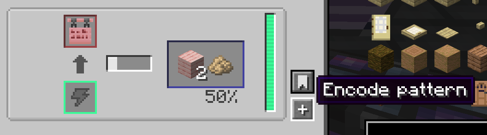
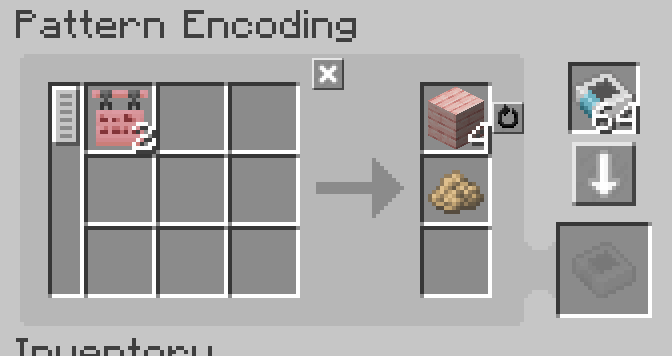

<div align="center">

# Deterministic Chance · 确定的概率

**把机器里的概率，写成 AE2 的确定答案。**

[](#运行环境)
[](#运行环境)
[](https://github.com/LangQi99/DeterministicChance/actions/workflows/build.yml)
[](LICENSE)



<br>



<br>

<sub>“我破解了概率样板。”</sub>

</div>

---

## 这是什么？

**Deterministic Chance（确定的概率）** 是一个面向 Minecraft 1.20.1 Forge 的概率配方兼容层。它把支持机器的概率产出改成可持久化的确定循环，并在从 JEI 向 AE2 样板编码终端填充配方时，生成结果完全对应的最小整数批次。

```text
原配方：1 A → 80% × 1 B
AE 样板：5 A → 4 B
机器循环：成功、成功、成功、成功、失败，然后循环
```

固定产物、多个独立概率产物和副产物可以一起换算。样板输入来自模组的**原生配方输入**，而不是从 JEI 当前显示槽反推，因此输入数量、可替代材料和多输入配方不会被界面展示方式误导。

## 它怎样工作？

项目只维护一套通用数学核心：把概率化成精确分数，对所有分母求最小公倍数，再一次性放大原生输入、固定产物和概率产物。比如：

```text
1 原木 → 6 木板 + 25% × 1 锯末
4 原木 → 24 木板 + 1 锯末
```

机器侧不会劫持全局随机数。每个已支持的模组家族只有两处薄适配：

1. 一个 JEI 配方适配器，读取原生输入、产物和概率；
2. 一个机器中央提交钩子，只在结果真正提交时推进序列。

因此维护单位是“一个模组的一族配方/机器”，不是逐条配方，也通常不是逐台机器。每台机器的相位写入自身 NBT；一个完整周期结束后，相应状态会被清理。

## 当前支持范围

所有第三方集成都属于**可选依赖**。未安装某个模组时，对应适配器不会加载。

| 模组 | 机器确定化 | JEI → AE2 精确样板 | 当前边界 |
| --- | --- | --- | --- |
| Mekanism | 精密锯木机、锯木工厂 | 支持锯切概率副产物 | 状态按具体机器隔离并持久化 |
| Create | 磨石、粉碎轮、序列组装 | Milling/Crushing 的独立概率产物；Sequenced Assembly 的互斥权重池及完整步骤消耗 | 序列组装覆盖压制、切割、部署、注液结尾；标准 `create:sequenced_assembly` KubeJS 配方无需额外依赖即可兼容 |
| Thermal Series | 中央机器输出提交路径 | 仅支持不会被催化剂/增强动态改变的锁定概率 | 可催化或可动态加成的 JEI 配方会明确拒绝，避免生成错误样板 |
| GTCEu Modern 7 | 已建模的独立 `OR` 概率输出 | 仅固定数量、固定概率且跨电压等级概率不变的独立 `OR` 输出 | `AND`、`XOR`、`FIRST`、范围数量、tick 输出或等级加成等不冒充精确结果 |
| Immersive Engineering | 粉碎机、标准电弧炉配方 | 支持 Crusher 与标准 Arc Furnace 概率副产物；电弧炉按配方/JEI 展示的概率语义修正原版反向比较 | 预览不推进相位，只有机器提交结果时才推进 |
| Productive Bees | 普通、动力与加热离心机 | 支持多个独立产物、`min..max` 数量范围、0–100% 概率及固定流体副产物 | 加热离心机会按实际语义去蜡；JEI 类别由真实输出槽区分；修正上游 `<=` 导致的 0% 仍可能产出问题 |
| Integrated Dynamics | 机械挤压机（Mechanical Squeezer） | 支持多个独立、固定数量的概率物品产物及固定流体产物 | 只覆盖可自动化的机械挤压机；脚踩式 Squeezer 不属于普通 AE2 处理链路 |

AE2 与 JEI 也都是可选依赖：只有需要“JEI 一键写入 AE2 样板”时才需要同时安装它们。

## 严格而不是猜测

JEI 适配结果分成三种状态：

- **不适用**：不是本项目认识的配方，交还原来的填充流程；
- **可精确规划**：写入换算后的原生输入与全部产物；
- **已识别但无法精确建模**：在 JEI 中明确报错并停止填充。

第三种状态很重要。比如 Thermal 的实际概率可能随机器配置变化，GTCEu 的概率可能随等级变化；此时宁可告诉玩家“无法精确编码”，也不会悄悄退回一个看似能用、实际会卡单的样板。

默认最大精确批次为 10,000 次，同时受 AE2 样板输入/输出槽数限制。分母最小公倍数过大或数量溢出时同样会明确拒绝。

## 使用时的重要约束

一张精确样板的整批输入，应由**同一个 AE provider 投给一台机器**处理。机器内的并行执行可以由适配器正确计数；但如果其他物流在机器外把同一张样板的输入拆给多台各自拥有相位的机器，单张样板不再保证恰好收到计划数量。

换句话说：确定性属于“每台机器自己的连续序列”，不是跨机器共享的全局计数器。

## 暂缓适配

- Create 风扇水洗/缠魂、工作盆及其他没有安全单机提交上下文的处理路径；
- Ender IO SAG Mill：概率取决于 Grinding Ball 等实际机器配置，JEI 静态配方不足以表达该状态；
- Industrial Foregoing：常见相关机制是动态结果、无消耗输入或方块破坏概率，目前没有值得信赖的统一静态概率输出接口。

这些边界不是“找不到概率字段”，而是无法同时保证 JEI 样板与真实机器执行严格相等。只有能建立稳定机器上下文和精确配方语义时才会加入。

### KubeJS / 数据包配方

本模组不绑定 KubeJS API。KubeJS 或数据包只要最终注册成原生 `create:milling`、`create:crushing` 或 `create:sequenced_assembly`，就和 Create 自带配方走同一个适配器。序列组装支持整数或小数权重、多种互斥回收结果、loops、部署消耗品与注液输入。脚本在运行时回调中自行随机产出、替换原生 serializer，或在机器提交后再次改写结果时无法静态证明，JEI 精确样板不会假装支持。

## 测试

```bash
./gradlew test
./gradlew verifyGameTests
```

测试矩阵会分别以核心-only、单个可选模组集成以及完整组合启动。覆盖内容包括概率分数与批量计划、实际机器结果提交/保存恢复路径，以及生产 JEI 适配器经注册表生成计划后再通过 AE2 样板编解码器的链路。

Forge dedicated GameTest 没有客户端 JEI 界面，因而不能自动点击 JEI 按钮；最后一步 UI 交互仍需客户端冒烟测试。测试不会把“注册表 → AE2 codec”误称为完整客户端端到端测试。

## 运行环境

| 项目 | 版本 |
| --- | --- |
| Minecraft | 1.20.1 |
| Forge | 47.4.3（47.x） |
| Java | 17 |
| Applied Energistics 2（可选） | 15.4.10 |
| JEI（可选） | 15.49.x |
| Mekanism（可选） | 10.4.16 |
| Create（可选） | 6.0.8 |
| Thermal Series（可选） | 1.20.1 11.x |
| GTCEu Modern（可选） | 7.5.3 |
| Immersive Engineering（可选） | 10.2.0-183 |
| Productive Bees（可选） | 1.20.1-12.6.0 |
| Integrated Dynamics（可选） | 1.30.8 |

构建所用的精确版本见 [`gradle.properties`](gradle.properties)，生产模组元数据仍将各项集成声明为可选。

## 开发构建

```bash
./gradlew build
./gradlew runClient
```

构建产物位于 `build/libs/`。更完整的适配契约、状态模型与测试边界见 [架构说明](docs/ARCHITECTURE.md)。

## 许可证

Deterministic Chance 使用 [MIT License](LICENSE) 开源。所有可选模组的内容仍分别受其自身许可证约束。
